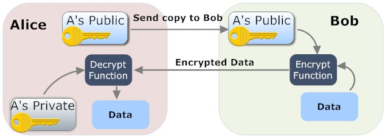
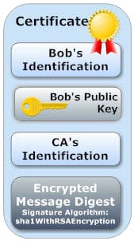

# Lab 2 - Securing MQTT Connection

## Some admin stuff

1. At time point of time, your vagrant container must be working. If not get
   this sorted.
2. Upload (again if you have done this) the ssh key generated by vagrant. It
   should be called `id_rsa.pub`. Also, make sure there is exactly one such
   file.
3. Make sure at least one member from your group has got AWS credentials
4. Update the repository. Run

    ```bash
    git reset --hard
    git pull
    ```
5. Mark your attendance. Also, please indicate which group you belong to. I
   need to create groups in moodle so that you can upload the report.

## Overview

In real world applications, you would want all the communications between the
device and the broker occur in a secure manner. This would mean that you would
have to solve three well known problems in security, first to establish true
identities of your recipients, and second to communicate in secure manner so
that a snooping party cannot understand the messages in between, and lastly to
establish that the message has not been tampered. Modern IoT communication
protocols, including MQTT, has security included in its definition and the goal
of this lab is to get a working understanding of how this is done.

Security in MQTT is implemented primarily by two means -- a password based
authentication, and by mutual authentication using Transport Layer Security
(TLS) and Secure Sockets Layer (SSL) protocol that sits on top of the TCP
layer. In this lab we will demonstrate the more interesting TLS/SSL based
security scheme. A deep discussion of TLS/SSL is out of scope, so only a
working knowledge is presented. If you don't know what TLS/SSL is, be sure to
go through the _Appendix_ bellow. Without a working knowledge, it is difficult to
motivate the rest of steps you do in the lab.

## Generating Certificates for Arduino

Arduino MKR WiFi1010 has an inbuilt [cryptographic
co-processor](https://www.microchip.com/wwwproducts/en/ATECC608A) that
generates and securely handles keypairs. We will first generate a keypair and
then generate a Certificate Signing Request (CSR). The cryto module stores the
private key and exposes the public key through CSR. This way, no one can read
the private key and hence the device is secured against leaks in cases when
access to device is compromised (conditions apply ;) ).

1. To generate a certificate, open the sketch _ECC08CSR_ from the
   `project_home`.  If you are using Arduino Create, you may have to import
   this sketch.  
2. Open *Monitor* (or *Serial Monitor*) and change *New Line* in the drop down
   to *Both NL & CR*.  Baud rate is set to 9600 by default. Compile and upload
   the sketch. (install the library ArduinoECCX08)
3. If the prompt *The ECCX08 on your board is not locked, would you like to
   PERMANENTLY configure and lock it now? (y/N) [N]:* comes, select *y* and
   *Send*. Fill in Country code (FI), State or Province name (Turku), Locality
   name (Turku), Organisation name (AA), Organisational Unit Name (IT), Leave
   the common name as it is, Slot (0)
   (0) and finally send *Y*.
4. Copy the CSR into a plain text file and store it in the directory as
   *arduino.csr*.

## Register with AWS IoT

In our case we will register our device with AWS IoT core. 

1. Log into the AWS console from https://aws.amazon.com using the provided username and password.
2. Once logged into the AWS Management Console, **ensure that you are in
   _Frankfurt_ region.** This information is in the top right corner of the page.
3. Under All Services, select _Internet of Things_, and open _IoT Core_.
4. Click Register a thing. We will register your device now.
5. Click _Create a single thing_.
6. In the page _Add your device to the things registry_, give your Thing a
   unique name, say _arduino-groupX_. With rest as defaults, select _Next_.
7. In the page _Add a certificate for your thing_, use _Create with CSR_.
   Upload the *arduino.csr*.
8. In the page, _Add a policy for your thing_, don't attach any policy. Click
   _Register Thing_.

### Policy and certificates

Generally, you want to restrict the capabilities of the device based on its use
case. Giving all device read+write access is a bad practice. Here we will
create a policy and attach it to your thing.

1. From the left menu, go to _Secure_ and _Policies_. Click _Create_ to create
   a new policy.
2. Name a policy _Arduino-Policy_. Add `iot:*` under _Action_ and `*` under
   _Resources_. Click _Allow_ under _Effect_. Click Create. Note that we are giving all
   permissions to modify all resources. In general, this is a bad practice. See
   the optional exercise for how to design a good policy.

Now we will attach this policy to the device. In AWS, attaching a policy to a device
is same as attaching the policy to a certificate.

1. From the left menu, go to _Manage_ and _Things_. Select the Thing you
   created in last section.
2. Go to _Security_ and click on the certificate card.
3. On the top left, click on _Actions_ and attach the _Arduino-Policy_.

Now the certificate is ready to be downloaded.

1. In the same page, click on _Actions_ and _Download_. Rename the downloaded
   certificate as `arduino_client.pem.crt` and save it in your project directory.

## Secure MQTT connection

1. Import\Open the sketch `AWS_IoT` from `project_home`. Modify the secrets
   _SSID_, _PASS_ and _GROUP_.
2. Broker can found in _AWS IoT_ page. From the left menu, go to _Settings_.
3. Fill the `client_certificate` within the paranthesis `()` with text of
   `arduino_client.pem.crt` similar to the one of `root_ca`. The root CA was
   obtained from this [link](https://www.amazontrust.com/repository/AmazonRootCA1.pem).
5. Load the program and verify that it connects to AWS IoT broker.

### Test the connection

Instead of using a mosquitto subscriber, we will use the client implementation from
AWS.

1. From the left menu under _AWS IoT_, select _Test_.
2. Type in the topic to subscribe (read the Arduino code). Select _Display
   payload as strings_ and finally select _Subscribe to topic_.
3. You can also send messages from the same window. Fill out _Publish to topic_
   with the correct topic and send the messages.

## To do

1. Understand the code
2. Explain your understanding of TLS/SSL mutual authentication mechanism with
   respect to the Arduino and AWS IoT core.  Make use of diagrams. Check the references for some useful references on this topic.
3. What are the pros and cons of using TLS/SSL mutual authentication? (Check
   references)
4. Assuming that the symmetric encryption was carried out by the WiFi module,
   what was the role of the crypto processor during the TLS/SSL handshake.

**When you are done, remember to delete the created thing(s) !**

## Optional

Do these exercises and mention your findings in your report for extra points.

### Add another "Device"

You can use mosquitto publish subscribe client to talk to AWS. During device
registration, instead of using CSR, choose the first option _One-click
certificate creation (recommended)_.  Download the public key, private key and
certificate. Save as `client-public.pem.cert`, `client.key` and
`client.pem.cert`. Also, download the root CA from the link given above (or
copy from the Arduino code) and save as `root_ca.pem`. Activate the certificat.

Attaching a valid policy
remains same as that of an arduino. You can now publish/subscribe to a topic of
your choice using the commands below.

By default, Vagrant will share your project directory (the directory with the Vagrantfile) to /vagrant.

Publish:

```
vagrant> mosquitto_pub --cafile root_ca.pem --cert client.pem.cert --key client.key -t $topic -m $message -h $broker -p 8883
```

Subscribe:
```
vagrant> mosquitto_sub --cafile root_ca.pem --cert client.pem.cert --key client.key -t $topic -h $broker -p 8883
```

Replace `$topic`, `$broker` and `$message` with appropriate topic, broker host name and message respectively.

### Design a Policy

If you are interested in learning good policy designs, you can do the following
section.

Understand the policies better. Go through [AWS IoT Policy
Actions](https://docs.aws.amazon.com/iot/latest/developerguide/policy-actions.html)
to get an understanding of the policies that AWS IoT supports. Look through
some
[examples](https://docs.aws.amazon.com/iot/latest/developerguide/pub-sub-policy.html)
to get an idea on how policies are designed. 

Design a policy that only allows arduino to publish and subscribe to a range of
topics and disallow other devices from publishing or subscribing to topics used
by the arduino device.

## Appendix

### TLS/SSL

To establish an encrypted communication, we need to establish the identity
first. TLS/SSL relies heavily on [Public Key
Infrastructure](https://web.archive.org/web/20170220183843/http://www.net-security-training.co.uk/what-is-a-public-key-infrastructure)
(PKI). Public-key cryptography involves a key pair: a _public_ key that can be
shared around (like post box address) and a secret _private_ key (key to your
post box). The keys can be used for both identification and encryption. A
message is signed by using a private key and verified using a public key. 


So, if Alice signs her email with her private key and send it to Bob, then Bob
can verify that the message was indeed sent by Alice and not tampered with by
verifying it against Alice's public key. 



Encryption works in a similar fashion.  Alice can send encrypted message to Bob
by using Bob's public key. Bob can decrypt this message back using Bob's
private key. 

Establishing identity over public network is even more challenging as the client
cannot have all possible public keys of all possible servers in the world. So,
when client connects to a server, the server must send its public key. But, then
how would the client know that the public key truly belongs to the server and not
to a malicious snooper? TLS/SSL comes around this problem using trust chains for
identification.

A client knows that the server's identity is authentic (and vice versa) by
trusting a third party who has in turn established the identity of the server.
The trusting third party is also known as a [Certificate
Authority](https://en.wikipedia.org/wiki/Certificate_authority)(CA). Thus, if a
CA believes that the server's identity is authentic, the client by trusting the
CA, also knows that the server's identity is authentic. 



Identity is itself established by exchanging certificates.
[X509](https://en.wikipedia.org/wiki/X.509) is one of the certificate scheme
based on PKI that is used in TLS/SSL. X509 contains a public key of the server
along with other information about server such as hostname, organisation etc.
and is signed by the CA (or self-signed). The client only contains public keys
from few trusted CAs. By verifying that the certificate received from the 
server is indeed verified by a known CA, identity of the server is established.
Now, TLS/SSL proceeds with exchanging new public-private key for encrypted
communication. 

### Mutual TLS/SSL Authentication in MQTT

With MQTT, we need to not only establish the identity of the broker, the broker
must also establish the identity of the client.

With password based authentication, the TLS/SSL proceeds as in the HTTPS
example. A secure channel is first built by establishing broker's identity,
followed by exchange of username and password on the channel. Server then
establishes the client's identity using this information. This is similar to
logging into any website or web service.

Another recommended way of establishing client's identity is using same
approach as server authentication, but in reverse direction. Meaning, the
client will also send a X509 certificate to the server and if the client is
registered it the server, the identity is established. This way, the client
authentication is done at the same time as server authentication.  The
additional security protects broker from certain DDoS attacks in addition to
Man-in-The-Middle attacks and acts as a authentication mechanism. 


The downside is that every device has to now generate a X509 certificate,
install them in the broker and manage these certificates. 

## References

1. [Public Key
   Infrastructure](https://web.archive.org/web/20170220183843/http://www.net-security-training.co.uk/what-is-a-public-key-infrastructure)
2. [PKI for busy people](https://rehn.me/posts/pki-for-busy-people.html)
3. [Certificate management for Embedded
   Systems](https://realtimelogic.com/blog/2013/10/Certificate-Management-for-Embedded-Systems)
3. [MQTT Security
   Fundamentals](https://www.hivemq.com/mqtt-security-fundamentals/)
4. [IoT security: when X.509 certificate authentication may not
   work](https://www.embedded.com/print/4442799)
5. [MQTT Wiki](https://github.com/mqtt/mqtt.github.io/wiki)
6. [MQTT Protocol v3.1.1 - Chapter 5, Security
   ](https://docs.oasis-open.org/mqtt/mqtt/v3.1.1/errata01/os/mqtt-v3.1.1-errata01-os-complete.pdf)
