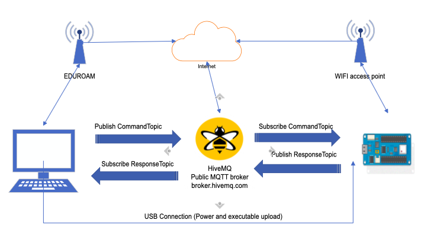
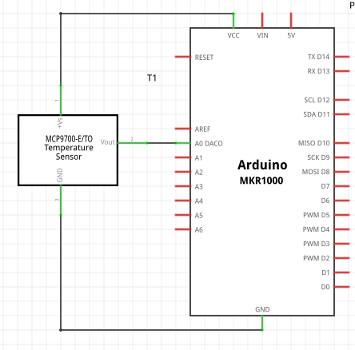
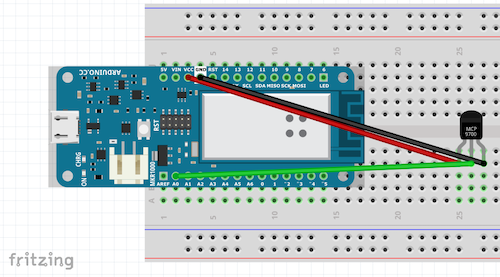

# Lab 1 - Lab setup + MQTT with Arduino MKR WiFi1010

## Goals and Overview

The emerging and existing IoT frameworks share some central IoT architectural
features. A central pattern seems to be about discovering, connecting,
monitoring, controlling and/or interacting with a system of _smart things_ or
_Things_ (with capital T), where a Thing is an abstract notion of a digitally
augmented physical object. Digital augmentation is one or more combination of
sensors, actuators, computation element or communication interfaces attached to
the physical object. So, a Thing can be a circuit package with one sensor, or
multiple sensors and actuator, or even a group of devices mimicking a physical
object.

[Three
patterns](https://www.w3.org/Submission/wot-model/#web-things-integration-patterns)
emerge when it comes to binding the Things together. Direct Connectivity refers to
a pattern where each Thing is directly connected to another Thing. Each Thing
has its own application program interface (API) and they communicate with each
other using a standardised API. However, this is indeed the most difficult
approach due to diverse communication standards, lack of processing and
operational power on the devices to support full-fledged networking stack, and
lack of standardisation of the API.
[W3C](https://www.w3.org/Submission/wot-model) is coming up with one such
standard and is yet to be ratified. 

Gateway-based connectivity is the second pattern, where a Thing cannot offer an
API directly and sits behind an intermediary. The gateway mimics the Thing and
provides an API on behalf of the Thing. The last common pattern is the
cloud-based connectivity. This is similar to a gateway approach, the cloud
service provides the API for the Things. The difference lies in the fact that
the gateway can be physically closer to the Things. The interaction between
gateway/cloud and the Things themselves could be orchestrated through a tightly
coupled, proprietary communication protocols, that is lighter on power and
computational load when compared to full internet stack.

In the lab, we will focus on the cloud and gateway pattern. We will use MQTT
protocol to directly interact with the devices first and then subsequently
conduct the interactions through a gateway. In process, the goal is to
recognise some good practices when it comes to deploying a Thing network and
this is demonstrated using Amazon's IoT and Greengrass product. We will cover
common security practices that involve authorisation and authentication issues.
We will also touch upon elastic edge computing, if time permits.

Concretely, the lab exercises are designed to achieve the following learning
goals:

1. Lab 1: Get a working understanding of the MQTT protocol. Setup a rudimentary
   publisher and subscriber using a openly available broker.
2. Lab 2: Establish a secure MQTT connection and understand various parts of
   the setup
3. Lab 3: Establish a MQTT connection that is safe from (unintended) snooping
   and is private using a gateway.
4. Lab 4: Setup an edge - a local computing platform on the gateway for your
   devices to offload its computation. Connect a device to the edge and perform
   some computations. 

## Grading and Expectations

The lab work is graded based on a sumitted report team at the end of last Lab (one report for all the labs).
Each lab
exercise has a set of questions in the end that is to be answered, with the
goal of demonstrating working knowledge of concepts involved. You are
encouraged to provide any pictures, graphs, screenshots, diagrams etc. that
help understanding your solution. If you use content (picture, graphs, etc.)
from other sources, remember to properly cite and provide reference to the used
external sources. Add as appendix to your report the implemented source code (be sure your code is easily readable and understanble). 

At the end of the report you should also provide a reflection on
what you learned during this exercise. This section could provide answers to
the following questions:

1. Have you learned anything new?
2. Did anything surprise you?
3. Did you find anything challenging?
4. Did you find anything satisfying?

The report should contain full name and student number of each group member.

The expected size of this report is 8-12 pages of content.

The hard deadline for submission is ***31.03.2021 23:55***

## Setup your computer 
To perform lab exercises, you need to setup your computer. No extra computers will be provided and it is your responsibility to setup your computer.
It is assumed that you know some basic commands of linux.

For the Labs your will use a Virtualbox Ubuntu-based virtual machine (VM) as a development environment step. 
You should:

1. Download and install Virtualbox on your laptop: https://www.virtualbox.org/wiki/Downloads 
2. Download the VM from this link:
3. Import the downloaded VM into Virtualbox by selecting the downloaded .ova file. The current VM has 4GB of RAM - Feel free to adjust it based on your own laptop configuration
4. Check you can start the VM. 
- The used username and password is iotlabs/iotlabs.
- Feel free to change the screen resolution in ubuntu or to scale in/out the virtual screen (from the "screen logo" on the bottom left. 
- Feel free to create a shared folder between your physical machine and VM (Settings->Shared folder)
   


Navigate to `project_home/iot_labs` and run the following command. This will download ~1.6 GB virtual box consisting of the virtual environment. This will also create a file `id_rsa.pub` in your `project_home/iot_labs`.

Finally, copy the content of the `id_rsa.pub` file from your `project_home/iot_labs` and upload it in moodle.


## Lab 1 - Before you begin,

In this lab you will create a new IoT device using Arduino MKR WiFi1010 board.
The device will measure the room temperature and transmit to a remote server using
the MQTT protocol. You will establish an insecure link and measure the transmission
latency. You will also implement logic to perform actuation on the sensor based
on user commands.

For the lab we will use Arduino IDE: https://www.arduino.cc/en/Main/Software
The IDE is already avaialble from the provided VM.

Please do the following:


## Hardware and Software setup

### Update project files and Vagrant container

I will refer to the directory with Vagrant file as `project_home`. Update the files in
the `project_home` by fetching recent changes from the `git`. For linux this would be

```bash
cd /path/to/project_home
git reset --hard
git pull
```

In the same directory, update your vagrant container and bring it online.

```bash
vagrant reload
vagrant up
```

### Arduino setup

Collect the board and the required components. You will need:

1. [Arduino MKR WiFi1010 board](https://store.arduino.cc/arduino-mkr-wifi-1010)
2. Breadboard
3. [Thermistor IC](http://ww1.microchip.com/downloads/en/DeviceDoc/20001942G.pdf)
4. Upto 5 breadboard connectors
5. A USB type A to USB micro cable
6. WiFi credentials for Arduino

Meanwhile, set up an IDE for Arduino. For the lab we will use Arduino IDE: [download it here](https://www.arduino.cc/en/Main/Software) and install the IDE on your machine.
However, you could also use the web-based IDE. To use the web-based IDE, visit [Arduino
Create](https://create.arduino.cc/), create an account and log in. Click
`Getting Started`.  Scroll down and click on `Install Arduino Create Platform`.
Download and install the plugin for your operating system. Once plugin
installation is verified, you can use the web editor. 

Insert the Arduino to the breadboard. Make sure that Arduino pins are on either
sides of the central ridge of the breadboard and that all the pins are inserted
in the breadboard. (See the image below or ask me if you're unsure).

Now we will verify that Arduino Create has read and write access to the Arduino
board.  On Arduino Create, create a **New Sketch** and paste the code from
`led.c`. 

Verify, upload and save the sketch to the Arduino MKR WiFi 1010 board. If
everything goes well, you must see a yellow LED blinking on the board.

## MQTT Client Setup

The overall architecture of the system you will implement is described in the figure bellow:



In order to subscribe to the messages that your Arduino board would send,
we need to setup a MQTT client on your desktop. We will install the client
in the vagrant container.

Navigate to `project_home`. Bring up the container and ssh into it using
terminal.

```bash
vagrant ssh
```

**In the vagrant container**, install the MQTT client. (if you see commands
preceeding with `vagrant>`, then the commands are run inside the container, so
don't type `vagrant>` in the commands below!)


```bash
vagrant> cd /vagrant
vagrant> ./install_mosquitto.sh
```
Side notes for window users: before runing the script, open the script in vi (vi install_mosquitto.sh), remove the 2 lines (with dd) starting with "cd /etc..." and "sudo curl.." and press escape and enter the comand: 
``` 
:set fileformat = unix
:x
```

Run the following code in the vagrant container. 

```bash
vagrant> mosquitto_sub -h test.mosquitto.org -t "#"
```
You are receiving all messages from all topics published on test.mosquitto.org. If you get lot of text
messages as a response, your setup is working as expected. You can quit
the subscriber using `Ctrl+c`.

## Arduino + Temperature Sensor

Now we are set to measure room temperature and transmit to a remote MQTT server.
First setup the hardware as shown in the circuit diagram below.




The setup itself should similar to the figure below. The thermistor IC's pin
numbers are determined by holding the flat end towards you, with pins facing
downwards and counting from left. From the schematic, you connect first pin of
the thermistor to third pin on Arduino marked as **Vcc**. Connect the second
pin of the thermistor to second pin on the Arduino situated on the other side
of the Vcc and is marked as **DAC0/A0**. Connect the third pin of the Arduino
to the fourth pin of the Arduino board, marked as **GND**. GND pin is on the
same side as Vcc. 

**IMPORTANT: Do not flip Vcc and GND connections. Also, do not short Vcc and GND.
Power the board AFTER you verify that the circuit is correct**



Once the hardware is setup, create a new sketch and paste the code from `mqtt_unsecure.c`.
Have a look at the code and understand what it does before uploading the code.
Use the provided WiFi username and password. Remember to installe the ArduinoMqttClient library (Tools->manage Library)
Compile the code and upload it to the board. 

Verify the state of the Arduino board by connecting to the *Monitor* in the
IDE.  You can see the transmitted MQTT messages by subscribing to the topic
(read the code to get the relevant topic). **In your vagrant container**, run
the following code. Substitute `responseTopic` within the quotes (retain the quotes
later) with the topic your device is sending the messages into. You may have to
change the topic, so read the code.

```bash
vagrant> mosquitto_sub -h broker.hivemq.com -t "responseTopic"
```

### To do

1. Read and understand the code. Specifically understand the `getTemp`
   function. Explain its working in your report. Consult the
   [datasheet](http://ww1.microchip.com/downloads/en/DeviceDoc/20001942G.pdf)
   if necessary. Get a working understanding of the
   [WiFiNINA](https://www.arduino.cc/en/Reference/WiFiNINA) and
   [ArduinoMqttClient](https://github.com/arduino-libraries/ArduinoMqttClient)
   library, although you don't have to explain the functionality in the report.
2. Measure the latency of transmission. Use the function `micros()` to return the current
state of the timer in microseconds. 
3. Does the length of the message have an impact on latency of transmission?
4. What is the value returned by mqttClient.messageQoS() ? What does it means ?
5. What is the value returned by mqttClient.messageRetain() ? What does it means ?

## Command and Reponse

The code also has a subscriber component built in. Have a look at the function
`onMqttMessage`. This is called when the device receives a message. To see it
working, open another terminal and do the following. Replace "commandTopic" with
the appropriate topic name and "command" with appropriate message.

```bash
vagrant ssh
vagrant> mosquitto_pub -h broker.hivemq.com -t "commandTopic" -m "command"
```

### To do

1. Modify the publisher to transmit messages only when an appropriate command
   is received.
2. Modify your subscriber to implement these two commands
    1. The **ON** command will turn on the onboard LED. 
    2. Similarly, **OFF** command will turn off the onboard LED.
    3. The **TEMP** command will send the temperature on the appropriate
       response topic, once.
    4. Any other command will not generate a response.

Hint: Check
[String](https://www.arduino.cc/reference/en/language/variables/data-types/stringobject/)
to create strings. Read character by character and append to the string. Don't
forget to terminate with a Null character (`'\0'`) in the end. 

## Wrap Up

Well, that's it for today. You can return the components. You can safely
disconnect the MQTT broker and power-off your VM (from the top right corner of the window, like if you would shout down a real machine)


