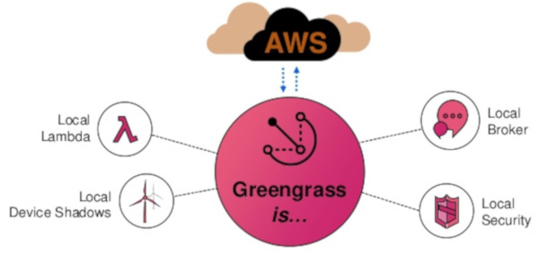
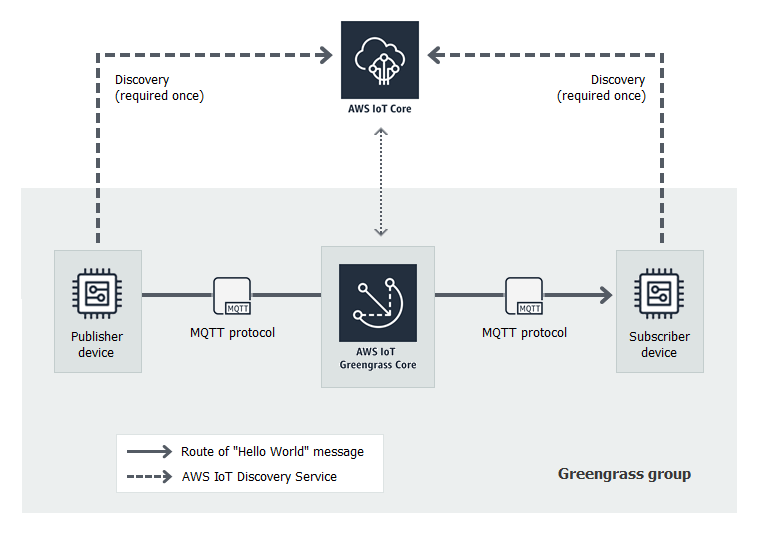
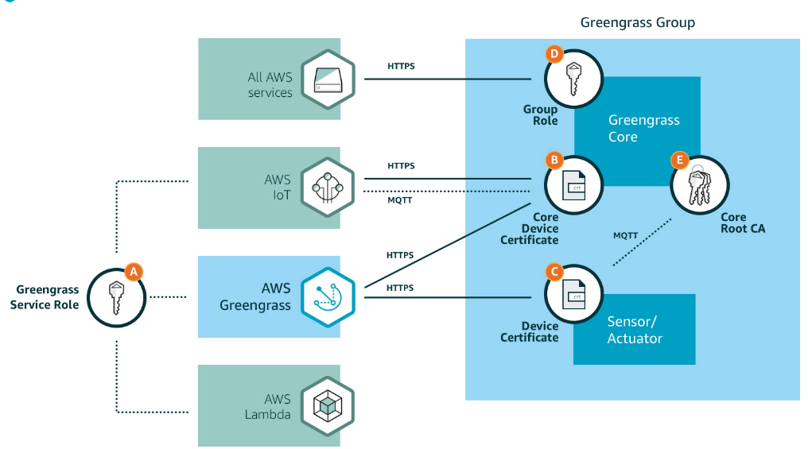

# Lab 3 - Organising Things with Gateways

## Overview

In the previous lab, we secured the connection between the MQTT broker and the
clients. However, there is still scope for unintended inter-device cross-talk.
You can restrict this by designing good policies and this was covered in one of
the optional tasks of the last lab. If the intention is to organise Things
together in a logical fashion, for e.g. at the customer level or at a level of
a floor of a building, then setting per customer and per device policy does not
scale. We need a better way of organising them and in process make sure that
the devices of one customer cannot
unintentionally connect with the devices of another customer. 

Gateways are one good way to achieve vertical hierarchy among things. Policies
are good way of managing horizontal hierarchy.  For instance, it is useful to
have write only policy to a certain topic for all the data coming from all
temperature sensors sold to all customers, while the gateways prevent reading
one customer's data by another (malicious) customer. Gateways also act as an
edge and provide local computational infrastructure. 

There are several concerns with the gateway pattern. You need to design and
sell an additional piece of hardware. The Things and gateway need to discover
each other and establish a secure connection to allow dynamic scaling of Things
infrastructure. A problem that is exacerbated when Things share or change
association between the gateways. The communication should not only be
coordinated between gateway and Things, but also between the Things and your
cloud server.  The logic (software) for collecting and analysing data from
Things connected to each gateway may differ and this requires a scalable
solution to deploy and manage logic across all of the gateways.

In this lab, we will demonstrate a secure gateway deployment using AWS
Greengrass. AWS Greengrass is a software that extends cloud capabilities to
local devices, negating many of the concerns associated with the gateway
pattern expressed above. Among other packages, Greengrass software consists of
a MQTT broker that acts as a bridge between AWS IoT broker and Things, a
computing platform similar to cloud instances but on the gateway, and a PKI
based secure communication setup.  Greengrass coordinates with AWS IoT service
and helps your Things to "automagically" discover a closest deployed gateway
and connect to it. Once the connection is established, the Things can collect
and analyse data closer to the source of information, react autonomously to
local events, and communicate securely with each other within local network
even when the gateway is cutoff from the internet.



The goal of this lab is to understand how scalable gateways can be deployed,
while managing a secure discovery and connection processes between Things.  You
will also test your setup for unintentional cross-talk. [Appendix](#appendix) gives a brief
explanation on various concepts that you will come across during the lab
exercise and walks you through discovery and connection management.

## Setup the hardware

1. We will use a Raspberry Pi as the device gateway. The device is already
   powered up and connected to network. To connect to the Raspberry Pi,
   you need the IP address of the gateway. The IP address should be given
   to you during the lab.
2. To connect to the gateway, in your VM open a terminal and ssh into it.
   The username is `pi` and password is `raspberry`.
   Commands run in Raspberry Pi is preceded `pi>` and in your VM as `vm>`.

   ```bash
   $ vagrant up
   $ vagrant ssh
   vm> ssh pi@IPADDRESS
   ```

## Setup a Greengrass Group

1. Login to AWS console. Under _Services_,  _Internet of Things_, open _IoT Core_.
2. From the left menu, select _Greengrass_ and select _Create a group_.
3. Click on _Grant permission_
3. Select _Easy Group creation (recommended)_ to generate certificates for the
   gateway.
4. Give a unique name for your group (e.g. `Group_GROUPNAME_NUMBER`). Click
   next.
5. You can leave the Core name as it is. Click _Next_. If another Core with a
   same name exists, then it will throw and error. 
6. You can click _Learn More_ to see what each step does. Check Appendix to
   learn more. Click _Create Group and Core_. 
7. Download the certificates to `project_home`. Create a folder and rename it
   to the name of the group you used (see step 4). This folder is referred to
   as `CERT_FOLDER`. Copy the archive to this directory. We will *not* extract
   the archive for now.
8. Download current Greengrass Core software to `CERT_FOLDER`. This software
   will run on the gateway.  The gateway's device certificates are hardcoded in
   the image you will download. As Raspberry Pi is Armv7l architecture and runs
   with Raspbian, we will download the corresponding image. 
9. Click _Finish_ when done with all the above two steps. If you have trouble
   creating a new group, refresh the page. This will bring you to Step 3. Here
   click on _Advanced_ mode. Select the same group name and attach _Greengrass
   ServiceRole_ as the policy. For Core, select from existing Core and click
   finish.

## Run the Greengrass core

1. In previous step, you downloaded gateway's certificates that has the form
   *GUID*-setup-tar.gz into the folder `CERT_FOLDER`, where *GUID* is a string
   of numbers and `CERT_FOLDER` is the location where you saved the
   certificates.
2. Copy the archive to the Raspberry Pi. The following commands will be useful:

	```bash
    vagrant> scp CERT_FOLDER/GUID-setup.tar.gz pi@IPADDRESS:/home/pi
    vagrant> scp CERT_FOLDER/greengrass-linux-armv7l*.tar.gz pi@IPADDRESS:/home/pi
	```
	
	The first command copies the security keys to the Raspberry Pi and second command copies the AWS Greengrass core binary to the Raspberry Pi.
3. Login to your assigned Raspberry Pi and extract the archives.

	```bash
    vagrant> ssh pi@IPADDRESS
    pi> sudo tar -xzv -f greengrass-linux-armv7l*.tar.gz -C /
    pi> sudo tar -xzv -f GUID-setup.tar.gz -C /greengrass
	```
    The first command logs you into the Raspberry Pi. The second command
    creates the `/greengrass` directory in the root folder of the AWS
    Greengrass core device (via the `-C /` argument). The second command copies
    the certificates into the `/greengrass/certs` folder and the `config.json`
    file into the `/greengrass/config` folder (via the `-C /greengrass`
    argument). For more information, see [`config.json` Parameter Summary](https://docs.aws.amazon.com/greengrass/latest/developerguide/gg-device-start.html#config.json-params)
 	
    **Verify**: If extraction was successful, you must see non-empty output for
    first command and for the second command, you must see files starting with
    `GUID`.
 	
 	```bash
    pi> sudo ls /greengrass/ggc/packages/1.10.0/
    pi> sudo ls /greengrass/certs/
 	``` 
 
4. Install the root CA onto your device. This certificate enables your device
   to communicate with AWS IoT using the MQTT messaging protocol over TLS. Run
   the following commands (note `-O` is capital `o` and not number `0`):
 
	 ```bash
    pi> cd /greengrass/certs
    pi> sudo wget -O root.ca.pem https://www.amazontrust.com/repository/AmazonRootCA1.pem
	 ```
	 
    **Verify**: `root.ca.pem` is not empty. The following command should show
    you the contents of the file: `> cat root.ca.pem` If `root.ca.pem` is
    empty, check the wget URL and try again.

5. You need to setup the Raspberry Pi for Greengrass. Follow steps 9--12 from [here](https://docs.aws.amazon.com/greengrass/latest/developerguide/setup-filter.rpi.html)
 
6. Use the following commands to start AWS Greengrass
 
	 ```bash
    pi> cd /greengrass/ggc/packages/1.10.0/
    pi> sudo ./greengrassd start
	 ```
	 
    **Verify**: The command exits with message "Greengrass successfully started
    with PID: "
 
7. On successful execution of step 6, type `pi> exit` to return to your
   development computer.

## Create Things

Unlike in previous labs, we will not use Arduino WiFi board to connect to the
Greengrass Core.  We will create a simulated Thing instead. This is because the
discovery process requires additional library that interacts with AWS IoT core
using REST APIs. In theory, we can do this with Arduino, but this will require
writing an additional library, something Arduino is lacking at this time.
Connecting Arduino WiFi to Greengrass is a nice little project of its own and
you are welcome to try it in your free time :)

The simulated Thing will be your terminal from your computer. To create a new
thing, we will create the key pair and register the public key with AWS IoT in
one step. 

1. Create a folder in `project_home` and call it `Publisher_Sim`. We will store
   certificates related to the new thing here.
2. From the left menu, go to _Greengrass_ and _Groups_.
3. Click _Devices_ and _Add Device_.
4. Choose _Create a new device_.
3. Give a unique name for the device. (e.g. Publisher_GROUPNAME). Rest can be
   defaults.  Click _Next_.
4. Next to _1-Click_, click _Use Defaults_
5. Download the certificate, public and private key and store it in
   `Publisher_Sim`.  You can rename the certificate, public and private key as
   `publisher_sim.pem.crt`, `publisher_sim-public.pem.key` and
   `publisher_sim-private.pem.key`.
6. Finally, download the root ca from
   [here](https://www.amazontrust.com/repository/AmazonRootCA1.pem) and store
   it as `root_ca.pem`.

Similarly create another Thing. Call it `Snoopy_subscriber_GROUPNAME`. We will
try to simulate a malicious subscriber using this Thing. After creation, click 
on the ellipsis and click _Detach_.

## Setup MQTT connections

Here we will setup a connection between your device and the cloud, through the
gateway.

1. In the group menu, select _Subscriptions_ and then _Add Subscription_.
2. As a source, select your device `Publisher_GROUPNAME` situated under
   _Devices_.  As a target, select _IoT Cloud_. Click _Next_.
3. Use `saiot/19/GROUPNAME/publish` as the publish topic, where GROUPNAME is a
   unique name of your group. Click _Next_ and _Finish_.

## Deploy the changes

Now we are ready to deploy our changes. Meaning, we will notify the gateway
of all the devices, subscriptions, policies etc. associated with our group.

1. In the _Greengrass Group_ menu, go to _Deployments_. 
2. Under _Actions_ click _Deploy_.
3. Next to _Manually configure Core endpoints_, click _Manually configure_.
4. Type in the IPADDRESS of your raspberry pi in _Endpoint_ and port as _8883_.
   Click _Next_. This is the IP address your device will try to connect after
   getting the group CA from the AWS IoT. Check the Appendix on how mutual
   authentication works.
5. Finally, in the Group page, click on _Deployments_. Click on _Actions_ and
   _Deploy_. This step downloads the group information to the gateway.

## Test the connection

1. From _AWS IoT_ -> _Test_, setup a new subscriber to the topic
   _saiot/19/GROUPNAME/publish_ . Select _Display payloads as strings (more
   accurate)_ option and then _Subscribe to Topic_.
2. In your vagrant container, run the following commands
    
    ```
    vagrant> cd /vagrant/Publisher_Sim
    vagrant> python3 ../pubSub.py -e ENDPOINT -r root_ca.pem -c publisher_sim.pem.crt -k publisher_sim-private.pem.key -n Publisher_GROUPNAME -t saiot/19/GROUPNAME/publish -m publish -M "Hello World" 
    ```
    
    You can get the ENDPOINT from _AWS IoT_ -> _Settings_ and under _Custom
    Endpoint_ . The names of topic must match with topic name in all the
    above steps. Name of the Thing give as `-n` option must match the name of
    the thing.

    **Verify**: If connection is not established, verify endpoint is correct.
    Also verify that the certificate paths are correct. The Thingname should be
    same as the Thingname in the Group under Greengrass page. Also verify that
    the topic exists.

## To do

1. Get a working understanding of the code `pubsub.py`. The documentation can
   be found
   [here](https://s3.amazonaws.com/aws-iot-device-sdk-python-docs/sphinx/html/index.html#module-AWSIoTPythonSDK.core.greengrass.discovery.providers)
2. Explain how the Thing connects to your gateway, including TLS mutual
   authentication. Use relevant diagrams. Check the folder `groupCA` in your directory.
3. Modify `pubSub.py` to measure the latency of transmission only. Use `time`
   module and use `perf_counter()` to measure the time. See
   [documentation](https://docs.python.org/3/library/time.html#time.perf_counter)

## Optional Tasks

### Verify privacy

Instead of using the `Publisher_Sim`, use `Snoopy_Subscriber_GROUPNAME` and try
to publish or subscribe to the same topic. 

### Hacked Thing

Lets say `Publisher_Sim` Thing was stolen and was hacked. From the device, the
hackers were able to retrieve group CA, topic, certificate, and thing name. As
the private key was stored in the EEPROM of the device, it remained a secret
and it was not stolen. Now check if you can connect to the Group and subscribe
or publish to the same topic. You need another piece of code `snoopy.py`
instead of `pubsub.py`. You also need to locate GROUPCA. It usually is in the
`Publisher_Sim`.

```
vagrant> cd /vagrant/Publisher_Sim
vagrant> python3 snoopy.py -i IPADDRESS -c publisher_sim.pem.crt -g GROUPCA -k Snoopy_Subscriber_GROUPNAME/snoopy_subscriber-private.pem.key -n Publisher_GROUPNAME -t saiot/19/GROUPNAME/publish -M "Snooping..."

```

What does this tell about a good practice to setup security in IoT devices?

## Appendix

A Greengrass _Group_ consists of exactly one _Core_ along with a logical
collection of Things. The _Core_ manages connection between Things, gateway and
IoT services along with providing a platform to deploy compute instances from
the cloud. AWS calls this computation platform as AWS Lambda and if time
permits, we will explore this in the next lab. 

A Thing gets associated with a Group when you associate Thing's certificate
with the Group. This is defined in the AWS IoT cloud interface. The Thing then
discovers the associated gateway through AWS IoT cloud service as shown in the
figure below. Information such as local IP address and Root CA is exchanged
between the Thing and AWS IoT service. The Thing can now contact the gateway
through the local IP address and after successful connection share data between
gateway and the AWS IoT service through gateway's MQTT broker.



The security setup is given in the figure below. 

(_A_) - AWS Greengrass and AWS IoT needs to have enough permission to access
each others services.

(_B_) - An X.509 certificate used to authenticate a specific gateway

(_C_) - An X.509 certificate used to authenticate a specific Thing

(_D_) - Group role. Similar to (_A_), but this time the Greengrass core running
on the gateway needs specific permissions to access other AWS cloud
infrastructure.

(_E_) - Group CA certificate. A root certificate used by Things to validate the
certificate presented by a gateway during TLS mutual authentication.



The mutual authentication happens as follows: 

1. The Thing contacts the AWS IoT service via HTTPS. Mutual authentication
   between the Thing and server occurs and authenticity of the AWS IoT server
   is established.
2. Similarly, the gateway also connects to the AWS IoT service via HTTPS. TLS
   mutual authentication is used to verify both AWS server and the gateway.
3. The AWS IoT server then sends all the groups a Thing is associated to, its
   respective IP address and their respective group CAs. Because we trust AWS
   IoT server (due to mutual authentication carried out in the previous step),
   the validity of group CA is also verified.
4. The Thing then connects to an interested gateway through the use of group
   CA. TLS mutual authentication happens between gateway and Thing now, and can
   be through MQTT. Local IP address is used to locate the MQTT broker, unlike
   the first and second step where an _endpoint_ was used.
5. Once connection is established, data now flows through the gateway to the
   server using MQTT protocol.

## References

1. [AWS Greengrass Documentation](https://docs.aws.amazon.com/greengrass/latest/developerguide/what-is-gg.html)
2. [AWS Greengrass SDK Documentation](https://s3.amazonaws.com/aws-iot-device-sdk-python-docs/sphinx/html/index.html#module-AWSIoTPythonSDK.core.greengrass.discovery.providers)
3. [AWS IoT Python SDK and samples](https://github.com/aws/aws-iot-device-sdk-python)
