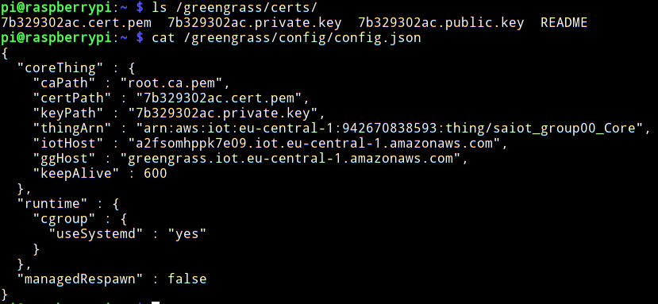
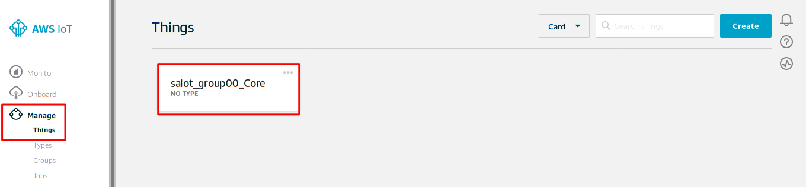
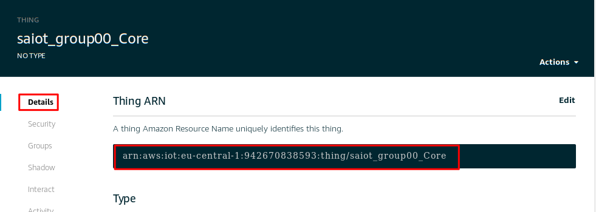
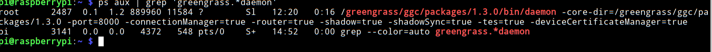
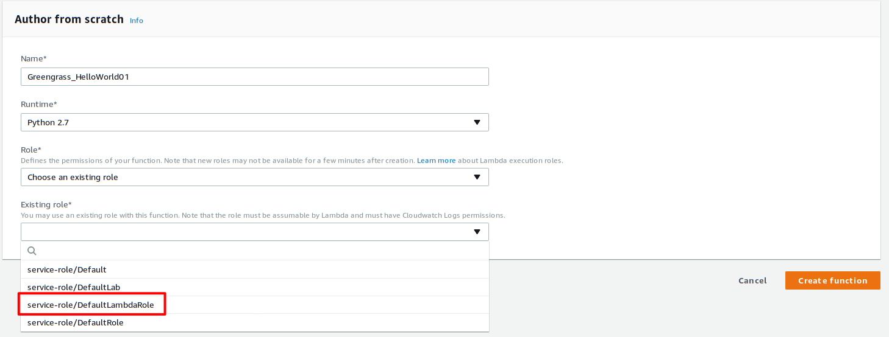
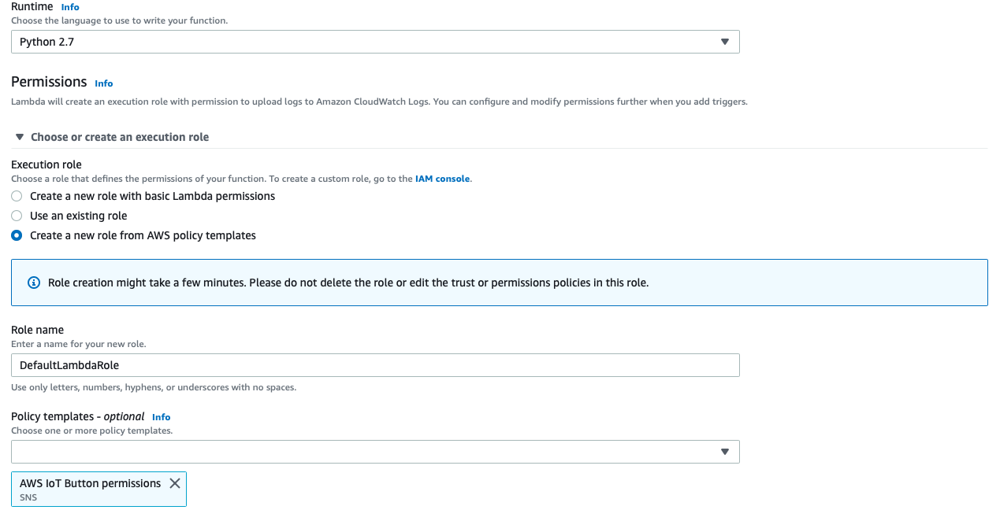
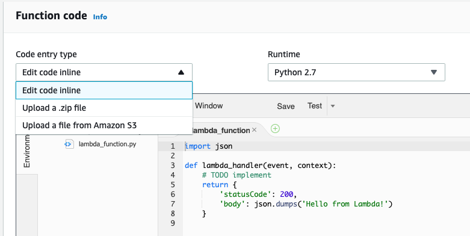
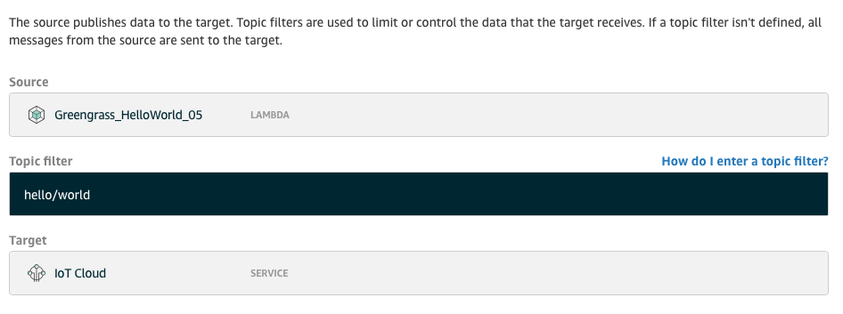

# Lab 4 - Edge compute with Lambda

## Overview

In the previous lab, we organised Things using gateways and ensured that there
were no unintended cross-talk between devices of different groups. In this lab,
we will extend gateway's usefulness to perform close-to-sensor computation.
Close-to-sensor computation, or edge-computation, is a new trend to manage
high-bandwidth data emerging from the sensors. By processing the data at the
edge, either completely or partially, we reduce the communication burden on the
network infrastructure. Also, for a latency critical application a gateway
reduces the response time between events and manages the risk related to
network outages.

There are several concerns with edge-computation. Unlike in the lab, you can
not always rely on the local network to SSH into the device. So a remote deployment
and management scheme is necessary. Also, the logic may vary from one gateway
to another. So we need a solution that scales and handles diverse computational
needs. 

Web-servers on gateways and a version control should meet most of the concerns
expressed above. Coupled with a dashboard to manage all the gateways, this solution
should scale if more gateways are added. AWS Lambda is a similar solution, but
without the need to setup a web-server or a dashboard. As a developer, you
would write the logic using one of the supported languages (python 2.7 in this case) and deploy them on
the gateway along with the device certificates, policies etc. 

The programming model of Lambda is event driven, similar to the subscription
mechanism of MQTT. Every time a message formatted as JSON document is sent to
the lambda either through MQTT or HTTPS, an event is triggered and the function
associated with the event is spawned in a virtual container. This on-demand
event driven function runs without the need of setting up a server. A
side-effect is that in the case of multiple events, multiple independent
Lambdas are invoked and managed. AWS calls this pattern as "event-driven
serverless computing". If you are interested in running a single Lambda for all
the events, then Lambda can also be configured to run in this fashion. 

AWS Lambda is suitable for running small on-demand applications that are
reactive in nature. For a heavy duty logic that process multiple streams from
different sources, you may want to forward the data to the cloud and process
them there. The course on Cloud Computing handles this topic in detail.

In this lab, we will deploy a Lambda function on the gateway and make it
respond to events sent by cloud as well as devices in the group.

## Run Greengrass Daemon

In your last lab exercise, you had installed AWS Greengrass runtime on the
Raspberry Pi along with the security keys. We will start the runtime so that
the edge connects to AWS Cloud services. 

1. Login to assigned Raspberry Pi
	```
	vm> ssh pi@IPADDRESS
	```

2. Verify that the contents of `/greengrass/config/config.json` is valid. You
   can view the file by
	```
	pi> cat /greengrass/config/config.json
	```

	

    **Verify**: A `config.json` is valid if -

    * `certPath` and `keyPath` starts with the `GUID` of your security key

    * `thingArn` is same as that of the Greengrass Group. To get the
          `thingArn` of your Greengrass Group, in AWS IoT Console, choose
          _Manage_ and _Things_. Select the core that starts with the
          Greengrass Group. The _Thing ARN_ is situated in the _Details_
          tab of the _THING_ page.  
          
          

4. Check if AWS Greengrass daemon is started already.
	```
	pi> ps aux | grep 'greengrass.*daemon'
	```
    If Greengrass daemon is active, you should get the output similar to the
    following:

	

	Otherwise, start the daemon with the following command:
	```
	pi> cd /greengrass/ggc/packages/1.10.0/
	pi> sudo ./greengrassd start
	```
    You can exit following successful start of the AWS Greengrass daemon:
	```
	pi> exit
	```

## Deploy AWS Lambda on AWS Greengrass Core

You are now ready to configure and deploy the Lambda function for AWS
Greengrass

### Create and Package a Lambda Function

In order for a Python Lambda function to run on a AWS Greengrass device, it
must be packaged with specified folders from the Python AWS Greengrass core
SDK. This step has already been done and you can find an archive
`hello_world_python_lambda.zip` in the folder `labsaiot`. You can view the
contents of this archive to verify that `greengrassHelloWorld.py` is packaged
with AWS Greengrass core SDK, which forms the external dependency.  You are now
ready to upload your Lambda function `.zip` file to the AWS Lambda console.

1. From the AWS Management console, under _Compute_, click _Lambda_. 

2. From menu on the left, click _Dashboard_. Click _Create Function_.

3. Choose _Author from scratch_ (this option may already be selected).

4. Give a unique name for your function, e.g. `HelloWorld_GROUPNAME`, and
   choose `Python 2.7` as _Runtime_. Check if `service-role/DefaultLambdaRole`
   exists in the _Existing Role_. If it does, select it and choose _Create a
   function_
	
	

    **Otherwise**, you can create a security role for your Lambda function by
    choosing _Create a new role from template(s)_ under _Role_. Use the
    _DefaultLambdaRole_ for _Role name_ and select _AWS IoT Button
    permissions_ under _Policy templates_. Next, choose _Create function_
    
    

5. On the _Configuration_ tab, in the _Function code_ region (scroll
   below), under the _Code entry type_ drop-down menu, choose _Upload a .ZIP
   file_. For _Runtime_, choose _Python 2.7_. For _Handler_, type
   _greengrassHelloWorld.function_handler_, and then upload
   `hello_world_python_lambda.zip` file from the `project_home` 


	

7. Click _Save_.

8. Now is a good time to go through the code and note important details such as
   publish topic.

9. When you are ready to deploy this version you can publish the code. To
   publish this Lambda function, under _Actions_, choose _Publish new version_.
   Write a description in the _Version filed_ field, such as _First version_
   (or leave it empty), then select _Publish_.

### Configure Lambda for AWS Greengrass

1. In the AWS IoT console, go to _IoT Core_ and _Greengrass_, and from _Groups_
   choose the group you created in the last lab.

2. On the _GROUP_ page, choose _Lambdas_. Next, choose _Add Lambda_

3. Choose _Use existing Lambda_.

4. Search for the name of the Lambda you created in the previous step, select it, and then choose _Next_. 

5. For the version, choose the latest version you created, and then choose
   _Finish_. 

6. You should see the Greengrass_HelloWorld Lambda function in your group.
   Choose the ellipsis (...) for the Lambda function, then choose _Edit
   Configuration_. This is the page where you can set the response timeouts and
   type of lambda. Set the timeout to 20s. Rest can be defaults. Click _Update_
   to exit.

A *long-lived Lambda function* starts automatically after AWS Greengrass
starts and keeps running in its own container (or sandbox). Repeatedly triggering the handler of a *long-lived Lambda function* might queues up responses from the AWS IoT Greengrass core.
This is in contrast to an *on-demand Lambda function* which might create a new container for a new invocation if the handler in previsouly created containers are still busy (i.e. processing data).
After this session, if you have time, you can change the settings and check the difference in behaviour. You can also have a look at these two examples: [here](https://docs.aws.amazon.com/greengrass/latest/developerguide/long-testing.html) and [here](https://docs.aws.amazon.com/greengrass/latest/developerguide/on-demand.html)

### Configure clients

An AWS Greengrass Lambda function can subscribe or publish messages (using MQTT protocol):

* To and from other devices within the AWS Greengrass core.
* To other Lambda functions
* To the AWS IoT cloud.

The AWS Greengrass group controls the way in which these components
interact by using subscriptions that enable greater security and to provide
predictable interactions. We will add new subscribers and publishers to
send/receive messages

1. Like in the last lab, add a publisher-subscriber between your Lambda and
   _IoT Cloud_. You must have noted the topic in the previous section.

	
   
2. Similarly, add a publisher-subscriber between in the reverse path. i.e. _IoT
   Cloud_ and your lambda. The topic for this direction can be anything, but
   not the same one you used in the previous step.

### Deploying on the Cloud

1. At this point, the AWS Greengrass core on your Raspberry Pi must be running.

2. On _GREENGRASS GROUP_ page, choose _Deployments_. Under _Actions_, choose _Deploy_.

## Verify the Lambda Function is Running on the Device

1. From the left pane of the AWS IoT console, choose _Test_
	
2. Setup the subscriber connecting on the topic you used in step 1 of the previous
section Configure clients (hello/world).

3. Publisher will send message to the topic used in step 2 of the previous section Configure clients.

Each publish is triggering the function handler and creating a new
container for each invocation. The invocation count need not increment for
every trigger because each on-demand Lambda function has its own
container/sandbox. If you publish and trigger the function after waiting
for timeout period (defaul 3s), you will see that the invocation count is
incremented.

This shows that a container, first created from a prior invocation, is
being reused, and pre-processing variables outside of function handler have
been used.
	
## To do

1. Understand the `greengrassHelloWorld.py` code that you had packaged into a
   Lambda function above.
2. Connect a device, one that you created in the last lab, with lambda. The
   setup you are looking at is given below. You can use `pubsub.py` to 
   publish messages from your device.
    1. Device -> Lambda. Device sends message on topic
       `saiot/GROUPNAME/lambda`
    2. Lambda -> IoT Cloud. Lambda parses the message sent by the device and
       forwards it to IoT Cloud on topic `saiot/GROUPNAME/cloud`.
3. Measure the transmission latency between the pubsub and lambda. Compare your
   findings with the latency values from the previous lab.

## Optional tasks

### Asset Monitor

We will make a latency critical application for the following scenario. The
scenario has a sensor that measures the temperature of an important asset and
sends the value to the edge. If the temperature goes beyond 40 C, the edge
responds by actuating an alarm and by indicating the cloud that alarm has been
sounded. In addition to viewing the logs, a user at the cloud can also issue
the command "TEMP" to get the current temperature of the asset.

You need to create a new an alarm actuator that acts as a subscriber and you
can use `pubsub.py` to simulate the alarm by using it as subscriber mode. Read
the code to find out how to do this. On successful actuation of the alarm, the
alarm device prints out a device indicating that the alarm has been actuated.
You may have to modify `pubsub.py` suitably.

To send the temperature, use `pubTemperature.py`. 

All your topics should begin with `saiot/GROUPNAME`

Modify the initial Lambda code as you seem fit and establish necessary forward
and backward connections to implement the scenario. 

#### Hints

1. This is a considerably long task and would require you to chart out the
   devices, paths and topics on a piece of paper. 
2. Debate what would be a good model to run Lambda functions. Would it be _On
   Demand_ or _Long running_?
3. Lambda function prints a log on Raspberry Pi gateway and this can serve as a
   good way to debug your implementations. To view the log do the following:

   ```
   pi> sudo -i
   pi> cd /greengrass/ggc/var/log/user/ZONE/CUSTOMERID/
   pi> tail -f LAMBDANAME.log
   ```

   ZONE is abbreviation of the zone AWS services are hosted and is similar to `eu-central`.

   CUSTOMERID is a string of number and is similar to `942670838593`.

   LAMBDANAME is the name of the Lambda function.

   You can explore `/greengrass/ggc/var` directory to find other useful logs
   for debugging purposes.

### Right Policies

Design and attach right policies for each device, lambda and gateway.
